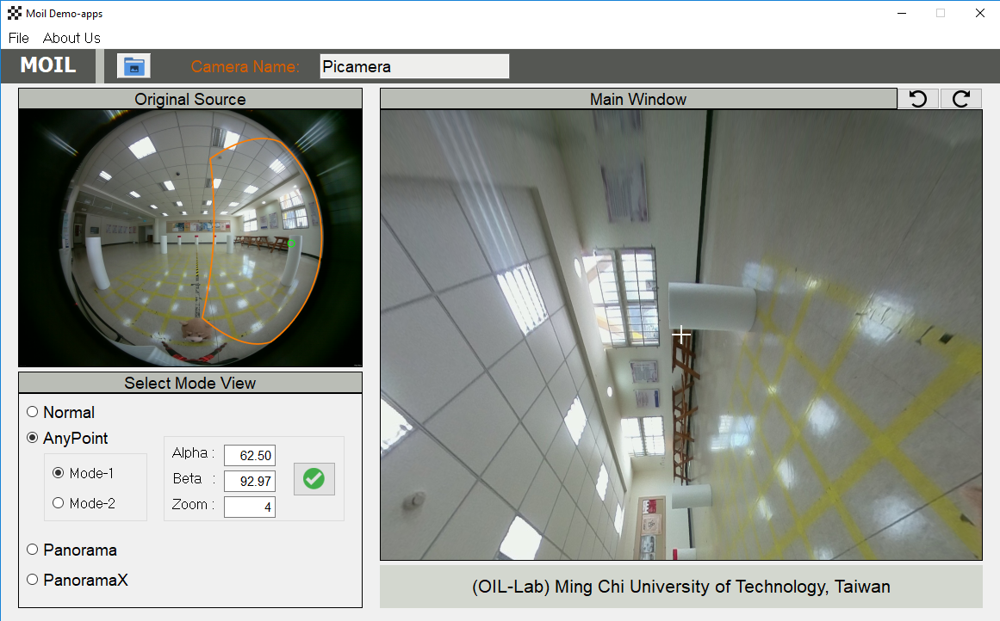

## Moil-Demo Apps

This apps is for implementation from the Moildev library in advanced image processing, know more about Moildev library [here](https://github.com/anto112/moildev)

**How to use:**

1. clone this repository

```
$ git clone https://github.com/anto112/moil-demo-apps.git
```

2. install requirement following this command:

```
$ pip install -r requirements.txt
```

3. run the apps:

```
$ python main.py
```

**example**

**Anypoint**



**PanoramaX**

